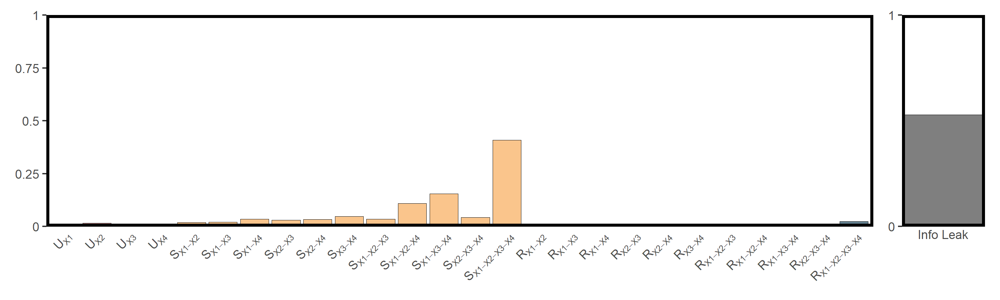
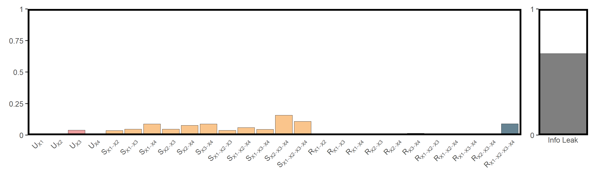
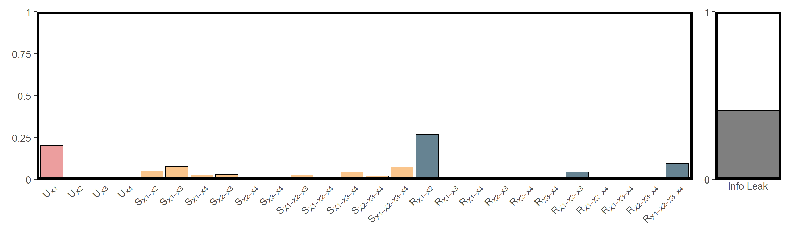

# Introduction

Understanding how causal influences combine and interact is essential for both temporal and spatial systems. The **Synergistic–Unique–Redundant Decomposition (SURD)** framework provides a principled way to break down total information flow between variables into:

* **Unique** contributions — information uniquely provided by one driver;
* **Redundant** contributions — information shared by multiple drivers;
* **Synergistic** contributions — information only revealed when drivers are considered together.

This vignette demonstrates how to perform SURD analysis using the `infocausality` package. We will explore both temporal and spatial cases, showing how `infocausality` unifies **time-series** and **spatial cross-sectional** causal analysis via consistent interfaces to `data.frame`, `sf`, and `SpatRaster` objects.

# Utility Functions

To simplify post-processing and visualization, two helper functions are provided below.

`utils_process_surd_result()` converts a `surd_list` object (as returned by an SURD computation routine) into a tidy `tibble` for plotting and further analysis.


``` r
utils_process_surd_result = \(surd_list,threshold = 0){
  I_unique = surd_list$unique
  I_synergistic = surd_list$synergistic
  I_redundant = surd_list$redundant
  info_leak = surd_list$info_leak

  df = tibble::tibble(
    label = c(
      paste0("U[", names(I_unique), "]"),
      paste0("S[", names(I_synergistic), "]"),
      paste0("R[", names(I_redundant), "]")
    ),
    value = c(as.numeric(I_unique),
              as.numeric(I_synergistic),
              as.numeric(I_redundant)),
    type = c(rep("unique", length(I_unique)),
             rep("synergistic", length(I_synergistic)),
             rep("redundant", length(I_redundant)))
  )

  df$value = df$value / sum(df$value)
  if(threshold > 0){
    df = dplyr::filter(df, value > threshold)
  }
  df$info_leak = info_leak
  return(df)
}
```

`utils_plot_surd()` produces a SURD decomposition plot — a grouped bar chart of **unique (U)**, **synergistic (S)**, and **redundant (R)** components, along with a side panel showing the **information leak**.


``` r
utils_plot_surd = \(surd_list,threshold = 0){
  I_unique = surd_list$unique
  I_synergistic = surd_list$synergistic
  I_redundant = surd_list$redundant

  df = tibble::tibble(
    label = c(
      paste0("U[", names(I_unique), "]"),
      paste0("S[", names(I_synergistic), "]"),
      paste0("R[", names(I_redundant), "]")
    ),
    value = c(as.numeric(I_unique),
              as.numeric(I_synergistic),
              as.numeric(I_redundant)),
    type = c(rep("unique", length(I_unique)),
             rep("synergistic", length(I_synergistic)),
             rep("redundant", length(I_redundant)))
  )

  df$value = df$value / sum(df$value)
  if(threshold > 0){
    df = dplyr::filter(df, value > threshold)
  }
  df$label = factor(df$label, levels = df$label)

  colors = c(unique = "#d62828", synergistic = "#f77f00", redundant = "#003049")

  p1 = ggplot2::ggplot(df, ggplot2::aes(x = label, y = value, fill = type)) +
    ggplot2::geom_col(color = "black", linewidth = 0.15, show.legend = FALSE) +
    ggplot2::scale_fill_manual(name = NULL, values = colors) +
    ggplot2::scale_x_discrete(name = NULL, labels = function(x) parse(text = x)) +
    ggplot2::scale_y_continuous(name = NULL, limits = c(0, 1), expand = c(0, 0),
                                breaks = c(0, 0.25, 0.5, 0.75, 1),
                                labels = c("0", "0.25", "0.5", "0.75", "1") ) +
    ggplot2::theme_bw() +
    ggplot2::theme(
      axis.ticks.x = ggplot2::element_blank(),
      axis.text.x = ggplot2::element_text(angle = 45, hjust = 1),
      panel.grid = ggplot2::element_blank(),
      panel.border = ggplot2::element_rect(color = "black", linewidth = 2)
    )

  df_leak = tibble::tibble(label = "Info Leak", value = surd_list$info_leak)
  p2 = ggplot2::ggplot(df_leak, ggplot2::aes(x = label, y = value)) +
    ggplot2::geom_col(fill = "gray", color = "black", linewidth = 0.15) +
    ggplot2::scale_x_discrete(name = NULL, expand = c(0, 0)) +
    ggplot2::scale_y_continuous(name = NULL, limits = c(0, 1), expand = c(0, 0),
                                breaks = c(0,1), labels = c(0,1) ) +
    ggplot2::theme_bw() +
    ggplot2::theme(
      axis.ticks.x = ggplot2::element_blank(),
      panel.grid = ggplot2::element_blank(),
      panel.border = ggplot2::element_rect(color = "black", linewidth = 2)
    )

  patchwork::wrap_plots(p1, p2, ncol = 2, widths = c(10,1))
}
```

# Example Cases

The following sections demonstrate SURD decomposition in different contexts, illustrating its flexibility across temporal and spatial causal analyses.

## Air Pollution and Cardiovascular Health in Hong Kong


``` r
cvd = readr::read_csv(system.file("case/cvd.csv",package = "tEDM"))
head(cvd)
## # A tibble: 6 × 5
##     cvd   rsp   no2   so2    o3
##   <dbl> <dbl> <dbl> <dbl> <dbl>
## 1   214  73.7  74.5  19.1 17.4 
## 2   203  77.6  80.9  18.8 39.4 
## 3   202  64.8  67.1  13.8 56.4 
## 4   182  68.8  74.7  30.8  5.6 
## 5   181  49.4  62.3  23.1  3.6 
## 6   129  67.4  63.6  17.4  6.73
```


``` r
cvd_long = cvd |>
  tibble::rowid_to_column("id") |>
  tidyr::pivot_longer(cols = -id,
                      names_to = "variable", values_to = "value")

fig_cvds_ts = ggplot2::ggplot(cvd_long, ggplot2::aes(x = id, y = value, color = variable)) +
  ggplot2::geom_line(linewidth = 0.5) +
  ggplot2::labs(x = "Days (from 1995-3 to 1997-11)", y = "Concentrations or \nNO. of CVD admissions", color = "") +
  ggplot2::theme_bw() +
  ggplot2::theme(legend.direction = "horizontal",
                 legend.position = "inside",
                 legend.justification = c("center","top"),
                 legend.background = ggplot2::element_rect(fill = "transparent", color = NA))
fig_cvds_ts
```


To investigate the causal influences of air pollutants on the incidence of cardiovascular diseases, we performed SURD analysis using a time lag step `3` and `10` discretization bins.


``` r
res_cvds = infocausality::surd(cvd, "cvd",
                               c("rsp", "no2", "so2", "o3"),
                               lag = 3, bin = 10, cores = 6)
## 
## SURD Decomposition Results:
##   Unique (U):
##     X1             : 0.0018
##     X2             : 0.0167
##     X3             : 0.0005
##     X4             : 0.0005
##   Synergistic (S):
##     X1-X2          : 0.0232
##     X1-X3          : 0.0167
##     X1-X4          : 0.0115
##     X2-X3          : 0.0169
##     X2-X4          : 0.0676
##     X3-X4          : 0.0405
##     X1-X2-X3       : 0.1263
##     X1-X2-X4       : 0.0319
##     X1-X3-X4       : 0.0536
##     X2-X3-X4       : 0.1394
##     X1-X2-X3-X4    : 0.3974
##   Redundant (R):
##     X1-X2          : 0.0101
##     X1-X3          : 0.0020
##     X1-X4          : 0.0000
##     X2-X3          : 0.0000
##     X2-X4          : 0.0029
##     X3-X4          : 0.0000
##     X1-X2-X3       : 0.0015
##     X1-X2-X4       : 0.0088
##     X1-X3-X4       : 0.0010
##     X2-X3-X4       : 0.0001
##     X1-X2-X3-X4    : 0.0291
##   Information Leak:  56.67%
```

The SURD results are shown in the figure below:


``` r
utils_plot_surd(res_cvds)
```



## Population Density and Its Drivers in Mainland China


``` r
popd_nb = spdep::read.gal(system.file("case/popd_nb.gal",package = "spEDM"))
## Warning in spdep::read.gal(system.file("case/popd_nb.gal", package = "spEDM")): neighbour
## object has 4 sub-graphs
popd = readr::read_csv(system.file("case/popd.csv",package = "spEDM"))
popd_sf = sf::st_as_sf(popd, coords = c("lon","lat"), crs = 4326)
popd_sf
## Simple feature collection with 2806 features and 5 fields
## Geometry type: POINT
## Dimension:     XY
## Bounding box:  xmin: 74.9055 ymin: 18.2698 xmax: 134.269 ymax: 52.9346
## Geodetic CRS:  WGS 84
## # A tibble: 2,806 × 6
##     popd  elev   tem   pre slope          geometry
##  * <dbl> <dbl> <dbl> <dbl> <dbl>       <POINT [°]>
##  1  780.     8  17.4 1528. 0.452 (116.912 30.4879)
##  2  395.    48  17.2 1487. 0.842 (116.755 30.5877)
##  3  261.    49  16.0 1456. 3.56  (116.541 30.7548)
##  4  258.    23  17.4 1555. 0.932  (116.241 30.104)
##  5  211.   101  16.3 1494. 3.34   (116.173 30.495)
##  6  386.    10  16.6 1382. 1.65  (116.935 30.9839)
##  7  350.    23  17.5 1569. 0.346 (116.677 30.2412)
##  8  470.    22  17.1 1493. 1.88  (117.066 30.6514)
##  9 1226.    11  17.4 1526. 0.208 (117.171 30.5558)
## 10  137.   598  13.9 1458. 5.92  (116.208 30.8983)
## # ℹ 2,796 more rows
```


``` r
res_popd = infocausality::surd(popd_sf,"popd",c("elev","tem","pre","slope"),
                               lag = 3, bin = 10, nb = popd_nb, cores = 6)
## 
## SURD Decomposition Results:
##   Unique (U):
##     X1             : 0.0046
##     X2             : 0.0000
##     X3             : 0.0398
##     X4             : 0.0036
##   Synergistic (S):
##     X1-X2          : 0.0369
##     X1-X3          : 0.0471
##     X1-X4          : 0.0885
##     X2-X3          : 0.0468
##     X2-X4          : 0.0765
##     X3-X4          : 0.0877
##     X1-X2-X3       : 0.0384
##     X1-X2-X4       : 0.0597
##     X1-X3-X4       : 0.0463
##     X2-X3-X4       : 0.1577
##     X1-X2-X3-X4    : 0.1095
##   Redundant (R):
##     X1-X2          : 0.0000
##     X1-X3          : 0.0089
##     X1-X4          : 0.0000
##     X2-X3          : 0.0130
##     X2-X4          : 0.0027
##     X3-X4          : 0.0138
##     X1-X2-X3       : 0.0056
##     X1-X2-X4       : 0.0000
##     X1-X3-X4       : 0.0120
##     X2-X3-X4       : 0.0110
##     X1-X2-X3-X4    : 0.0897
##   Information Leak:  64.64%
```


``` r
utils_plot_surd(res_popd)
```



## Influence of Climatic and Topographic Factors on Net Primary Productivity (NPP) in Mainland China


``` r
npp = terra::rast(system.file("case/npp.tif", package = "spEDM"))
npp
## class       : SpatRaster 
## size        : 404, 483, 5  (nrow, ncol, nlyr)
## resolution  : 10000, 10000  (x, y)
## extent      : -2625763, 2204237, 1877078, 5917078  (xmin, xmax, ymin, ymax)
## coord. ref. : CGCS2000_Albers 
## source      : npp.tif 
## names       :      npp,        pre,      tem,      elev,         hfp 
## min values  :   164.00,   384.3409, -47.8194, -122.2004,  0.03390418 
## max values  : 16606.33, 23878.3555, 263.6938, 5350.4902, 44.90312195
```


``` r
res_npp = infocausality::surd(npp,"npp",c("pre","tem","elev","hfp"),
                              lag = 3, bin = 10, cores = 6)
## 
## SURD Decomposition Results:
##   Unique (U):
##     X1             : 0.2028
##     X2             : 0.0009
##     X3             : 0.0000
##     X4             : 0.0000
##   Synergistic (S):
##     X1-X2          : 0.0502
##     X1-X3          : 0.0781
##     X1-X4          : 0.0305
##     X2-X3          : 0.0321
##     X2-X4          : 0.0031
##     X3-X4          : 0.0009
##     X1-X2-X3       : 0.0300
##     X1-X2-X4       : 0.0080
##     X1-X3-X4       : 0.0476
##     X2-X3-X4       : 0.0200
##     X1-X2-X3-X4    : 0.0756
##   Redundant (R):
##     X1-X2          : 0.2704
##     X1-X3          : 0.0015
##     X1-X4          : 0.0000
##     X2-X3          : 0.0000
##     X2-X4          : 0.0000
##     X3-X4          : 0.0000
##     X1-X2-X3       : 0.0470
##     X1-X2-X4       : 0.0000
##     X1-X3-X4       : 0.0053
##     X2-X3-X4       : 0.0000
##     X1-X2-X3-X4    : 0.0960
##   Information Leak:  41.30%
```


``` r
utils_plot_surd(res_npp)
```



---

🧩 *See also*:

* [`?infocausality::surd()`](https://stscl.github.io/infocausality/reference/surd.html) for function details.
* [`spEDM`](https://cran.r-project.org/package=spEDM) package for spatial empirical dynamic modeling.
* [`tEDM`](https://cran.r-project.org/package=tEDM) package for temporal empirical dynamic modeling.
